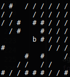

# AI Agent Capture the Flag Tournament

Welcome to the AI Agent Tournament! Your task is to design and implement an artificial intelligence for a team of agents competing in a game of Capture the Flag.

## The World

-   The game world contains randomly generated walls.
-   Flags are spawned randomly: a blue flag on the left side and a red flag on the right side.
-   Blue and red teams, each with three AI agents, spawn around their respective flags.
-   Agents will collide with walls and with their own flag (they cannot move through them).


## Win Conditions

There are two ways to win the game:
1.  Capture the enemy flag and bring it back to your own team's flag.
2.  Kill all enemy agents.
3.  The game ends in a tie if the maximum time limit is reached.

## Core Game Mechanics

-   **Health (HP):** Agents start with 3 HP and are eliminated when their HP reaches 0. Each bullet hit deals 1 damage. If multiple enemy agents occupy the same tile, a single bullet hitting that tile will damage all of them.
-   **Ammunition:** Agents start with 10 bullets. Firing a shot consumes one bullet.
-   **Healing & Resupply:** When an agent is within a 2-tile radius of its own flag's original spawn point, it will regain 1 HP and 1 ammo periodically. This allows agents to retreat, recover, and re-engage.
-   **Flag Dropping:** If an agent holding the enemy flag takes damage from a bullet, they will drop the flag. The flag immediately returns to its original spawn point.

## The `Agent` Class

You will be implementing your logic within the `Agent` class in a file named `agent.py`. It has the following methods:

-   `__init__(self, color, index)`
    -   Called once when your agent is instanced at the beginning of the game. Use it for any initial setup.
-   `update(self, visible_world, position, can_shoot, holding_flag, shared_knowledge, hp, ammo)`
    -   Called every "agent frame" or tick. This is where your agent's core logic will go.
-   `terminate(self, reason)`
    -   Called once when this agent is deleted (either because it died, or the game ended).
    -   The `reason` argument is a string that can have the following values:
        -   `"died"`: The agent was killed.
        -   `"blue"`: The game ended and the blue team won.
        -   `"red"`: The game ended and the red team won.
        -   `"tied"`: The game ended in a tie.

### `Agent.update` Arguments (Inputs)

The `update` method receives the following arguments on every call:

-   `visible_world`
    -   A 2D list representing everything the agent can see.
    -   Your agent is always in the center of this grid.
    -   The agent can see a maximum of 4 tiles in each direction (a 9x9 grid).
    -   Areas behind walls are marked as not visible.
    -   **Characters in `visible_world`:**

| Character | Description |
| :---: | --- |
| ` ` | Empty space |
| `#` | Wall |
| `b` | A blue agent |
| `r` | A red agent |
| `B` | A blue agent holding the flag |
| `R` | A red agent holding the flag |
| `{` | The blue flag |
| `}` | The red flag |
| `.` | A bullet |
| `/` | Unknown/unseen area (behind a wall) |



-   `position`
    -   A `tuple (x, y)` representing your agent's absolute coordinates in the world.

-   `can_shoot`
    -   A `boolean`. `True` if the shooting cooldown is over and the agent can shoot.
    -   Cooldown is activated after shooting and/or after moving. The agent must stand still for the cooldown to end.

-   `holding_flag`
    -   A `boolean`. `True` if your agent is currently holding the enemy flag.

-   `shared_knowledge`
    -   A Python `dictionary` that is shared between all agents on your team.
    -   You can read from and write to this dictionary to communicate and coordinate strategy. For example, you can store the enemy flag's last known position, assign roles, or signal for help.
    -   This dictionary is reset at the beginning of each game.

-   `hp`
    -   An `integer` representing your agent's current health points.

-   `ammo`
    -   An `integer` representing your agent's current ammunition count.

### `Agent.update` Expected Return Values (Outputs)

Your `update` method must return two values: an action and a direction.

-   `action` (string)
    -   `"shoot"`: To shoot in the specified direction.
    -   `"move"`: To move one tile in the specified direction.
    -   An empty string (`""`) or `None` will cause the agent to do nothing for that frame.

-   `direction` (string)
    -   `"left"`
    -   `"right"`
    -   `"up"`
    -   `"down"`

## Usage Instructions

1.  **Create a folder for your agent** (e.g., `my_team`).
2.  **Inside this folder, create a file named `agent.py`**. This file must contain your `Agent` class implementation.
3.  You are free to create other `.py` files/modules inside your team folder and import them into `agent.py`.
4.  **Start a simulation** with the command:
    ```bash
    python main.py path/to/blue/team/folder path/to/red/team/folder
    ```
    For example:
    ```bash
    python main.py my_team other_team
    ```
5.  To run the simulation much faster without the graphical display (headless mode), use the `--headless` flag:
    ```bash
    python main.py my_team other_team --headless
    ```
6.  To display an ASCII rendering of the game in the console, use the `--ascii` flag. This is particularly useful when running in headless mode.
    ```bash
    python main.py my_team other_team --headless --ascii
    ```

### Example Project Structure
```
tournament_project/
├── main.py
├── tournament.py
├── config.py
├── sprites/
│   ├── ... (image files)
├── my_team/
│   ├── agent.py          # <-- Your main agent code here
│   └── pathfinding.py    # <-- Optional helper module
└── other_team/
    └── agent.py          # <-- Another agent's code
```

### For Testing Purposes

-   Modify `config.py` to change world height, width, tick rate, and other game parameters.
-   Match results are automatically logged to `results.csv`.

### For Testing: Human-Controlled Agent

A special `human_player/agent.py` is available for testing purposes. This allows you to directly control one of your team's agents (the one with `index=0`) while the other two agents on the team operate with the standard AI logic. This is an excellent way to test your AI's behavior, experiment with strategies, or simply understand the game mechanics better.

**Controls:**
-   **Movement:** `W`, `A`, `S`, `D` keys
-   **Shooting:** `Up`, `Down`, `Left`, `Right` arrow keys

**Usage:**
To play as the blue team's lead agent against an AI opponent, run the simulation with the `human_player` folder:
```bash
python main.py human_player other_team
```
> **Note:** The human-controlled agent requires the graphical interface to read keyboard input. You cannot use the `--headless` flag when playing.

## Implementation Guidelines & Ideas

You are encouraged to use any/all means to implement a good agent. Some ideas include:
-   Reflex-based systems
-   Knowledge base and logical inference
-   Pathfinding algorithms (like A*)
-   Machine learning
-   Communication between your team's agents

> **LIMITATION:** Your agent must be able to run on the classroom computers without significant performance issues.

### Designing a Universal Agent
Your agent code must be able to function correctly whether it is assigned to the blue or red team. Avoid hardcoding behavior based on color (e.g., `if self.color == "blue": move_right()`).

A robust approach is to set team-specific variables in your `__init__` method based on the `color` argument provided. These variables can define your "enemy," "home," and preferred directions for attacking and defending. Your `update` method should then use these variables to make decisions. This makes your agent's logic abstract and reusable.

## Submission

You will need to upload a single `.zip` file of your **team folder** (`firstnames_lastnames.zip`). It must contain:

-   **`agent.py`** with your `Agent` class.
-   Any other `.py` files (modules) you created and used.
-   A short presentation (5 minutes), saved as a PDF file, explaining your approach.
