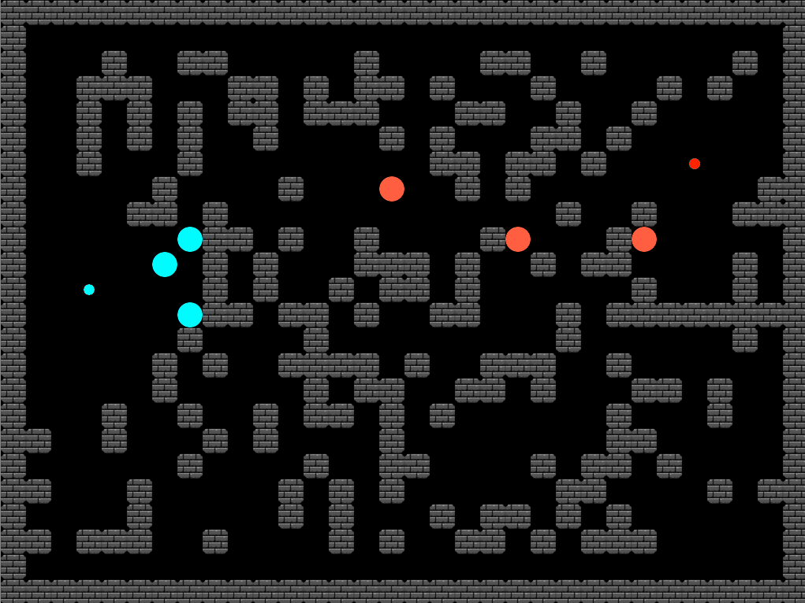

# AI Agent Capture the Flag Tournament

Welcome to the AI Agent Tournament! Your task is to design and implement an artificial intelligence for a team of agents competing in a game of Capture the Flag.

## The World

-   The game world contains randomly generated walls.
-   Flags are spawned randomly: a blue flag on the left side and a red flag on the right side.
-   Blue and red teams, each with three AI agents, spawn around their respective flags.
-   Agents will collide with walls and with their own flag (they cannot move through them).



## Win Conditions

There are two ways to win the game:
1.  Capture the enemy flag and bring it back to your own team's flag.
2.  Kill all enemy agents.

## The `Agent` Class

You will be implementing your logic within the `Agent` class. It has the following methods:

-   `__init__(self)`
    -   Called once when your agent is instanced at the beginning of the game. Use it for any initial setup.
-   `update(self, visible_world, position, can_shoot, holding_flag)`
    -   Called every "agent frame" or tick. This is where your agent's core logic will go.
-   `terminate(self, reason)`
    -   Called once when this agent is deleted (either because it died, or the game ended).
    -   The `reason` argument is a string that can have the following values:
        -   `"died"`: The agent was killed.
        -   `"blue"`: The game ended and the blue team won.
        -   `"red"`: The game ended and the red team won.
        -   `"tied"`: The game ended in a tie.

### `Agent.update` Arguments (Inputs)

The `update` method receives the following arguments on every call:

-   `visible_world`
    -   A 2D list representing everything the agent can see.
    -   Your agent is always in the center of this grid.
    -   The agent can see a maximum of 4 tiles in each direction (a 9x9 grid).
    -   Areas behind walls are marked as not visible.
    -   **Characters in `visible_world`:**

| Character | Description |
| :---: | --- |
| ` ` | Empty space |
| `#` | Wall |
| `b` | A blue agent |
| `r` | A red agent |
| `B` | A blue agent holding the flag |
| `R` | A red agent holding the flag |
| `{` | The blue flag |
| `}` | The red flag |
| `.` | A bullet |
| `/` | Unknown/unseen area (behind a wall) |


-   `position`
    -   A `tuple (x, y)` representing your agent's absolute coordinates in the world.

-   `can_shoot`
    -   A `boolean`. `True` if the shooting cooldown is over and the agent can shoot.
    -   Cooldown is activated after shooting and/or after moving. The agent must stand still for the cooldown to end.

-   `holding_flag`
    -   A `boolean`. `True` if your agent is currently holding the enemy flag.

### `Agent.update` Expected Return Values (Outputs)

Your `update` method must return two values: an action and a direction.

-   `action` (string)
    -   `"shoot"`: To shoot in the specified direction.
    -   `"move"`: To move one tile in the specified direction.
    -   An empty string (`""`) or `None` will cause the agent to do nothing for that frame.

-   `direction` (string)
    -   `"left"`
    -   `"right"`
    -   `"up"`
    -   `"down"`

## Usage Instructions

1.  **Code your agent** in `blue_agent.py` and/or `red_agent.py`. You are free to create other `.py` files/modules and import them into your agent implementation. **Do not change any other existing files.**
2.  The implemented agent should be **functional as both a blue and red agent**, as your code will be used for both teams during the tournament.
3.  **Start the simulation** with the command:
    ```bash
    python main.py
    ```

### For Testing Purposes

You can modify the following for easier testing:
-   Modify `config.py` to change world height, width, and tick rate.
-   Comment out `world.ascii_display()` in `main.py` to disable the console display.

## Implementation Guidelines & Ideas

You are encouraged to use any/all means to implement a good agent. Some ideas include:
-   Reflex-based systems
-   Knowledge base and logical inference
-   Pathfinding algorithms (like A*)
-   Machine learning
-   Communication between your team's agents

> **LIMITATION:** Your agent must be able to run on the classroom computers without significant performance issues.

## Submission

You will need to upload a single `.zip` file containing:

-   **`blue_agent.py` and `red_agent.py`**
    -   Both files should contain the same agent implementation.
    -   Include a short description of your agent's approach, strategy, and implementation as a comment at the beginning of each file.
-   **Other `.py` files (modules)** you might have created and used in your agent implementation.
-   **A short presentation (5 minutes)**, saved as a PDF file, explaining your approach, strategy, and implementation. Do not explain the code line-by-line; focus on the high-level concepts.